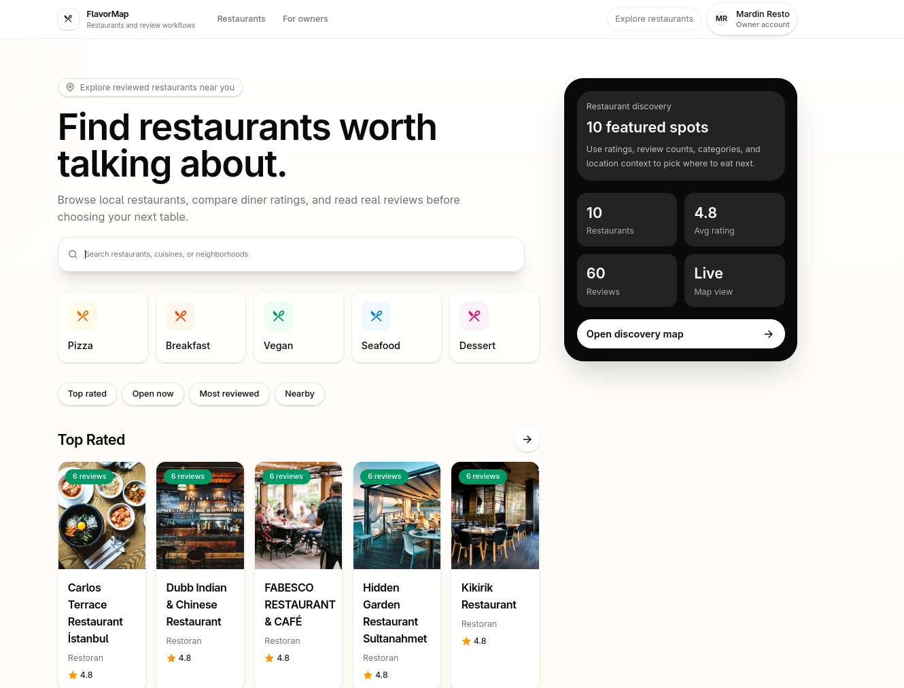
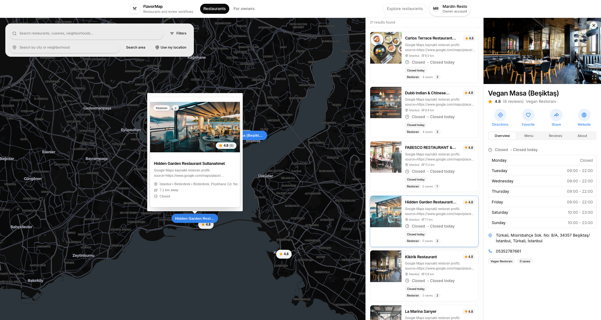
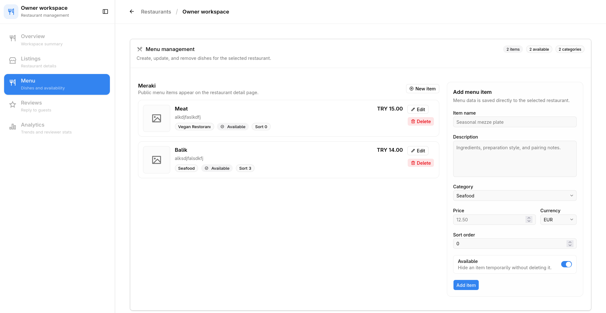
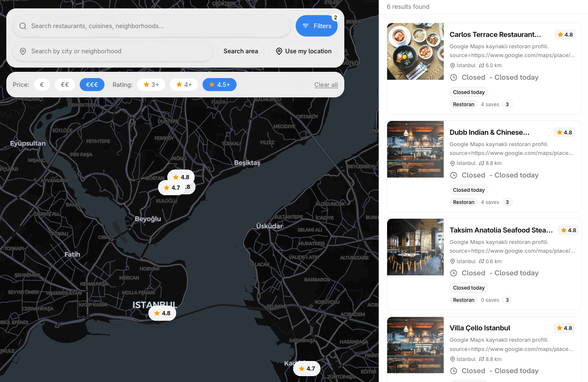
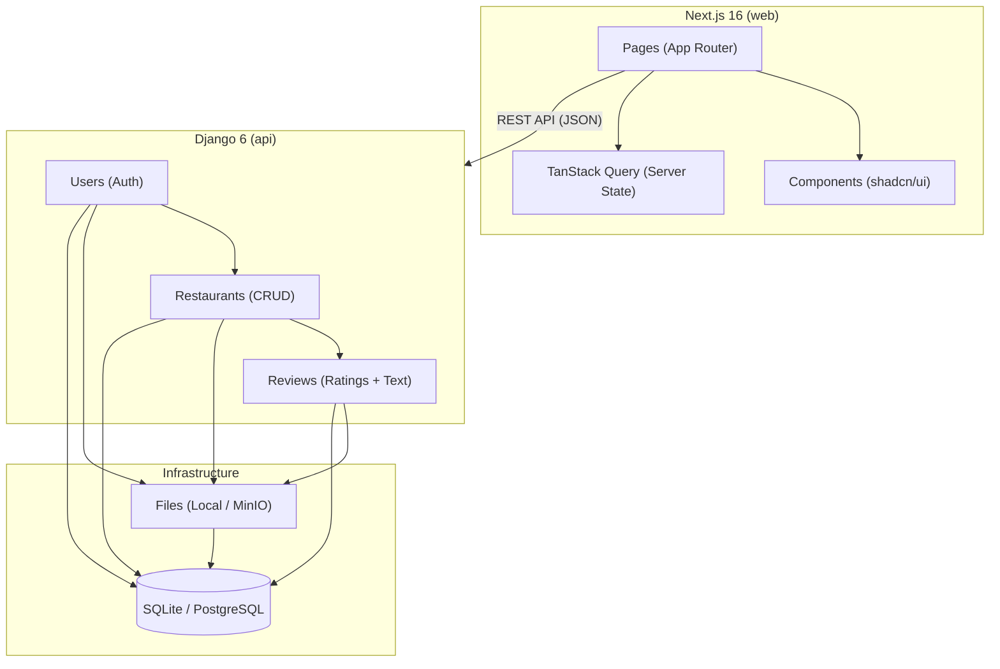

# FlavorMap

A restaurant review & discovery platform — a modern alternative to Yelp/Google Reviews. Built as the final assignment for **CSE-220 Web Programming** at Acibadem University.

Users can discover restaurants on an interactive map, read and write reviews, rate establishments, upload photos, and build their foodie profile — all through a fast, responsive web interface.

---

## Table of Contents

- [Features](#features)
- [Demo](#demo)
- [Tech Stack](#tech-stack)
- [Project Structure](#project-structure)
- [Getting Started](#getting-started)
  - [Prerequisites](#prerequisites)
  - [Quick Start](#quick-start)
  - [Manual Setup](#manual-setup)
- [Developer Guide](#developer-guide)
  - [Nx Workspace Commands](#nx-workspace-commands)
  - [Backend Development](#backend-development)
  - [Frontend Development](#frontend-development)
  - [Database Migrations](#database-migrations)
  - [Environment Variables](#environment-variables)
- [API Documentation](#api-documentation)
- [Testing](#testing)
- [Code Quality](#code-quality)
- [Architecture](#architecture)
- [Deployment](#deployment)
- [Development Timeline](#development-timeline)
- [License](#license)

---

## Features

- **Interactive Map Discovery** — Browse restaurants on a MapLibre GL map with real-time clustering and radius filtering
- **Restaurant Profiles** — Detailed pages with ratings, reviews, photos, hours, cuisine tags, and location info
- **Review System** — Write reviews with 1–5 star ratings, text, and photo attachments
- **User Authentication** — Session-based auth with email login, profile management, and review history
- **Photo Uploads** — Attach photos to reviews and restaurant listings (local storage or MinIO S3)
- **Search & Filter** — Full-text search by name, cuisine, or location with advanced filters
- **Responsive Design** — Mobile-first UI built with shadcn/ui and Tailwind CSS v4

---

## Demo

### Home Page



The main landing page with search bar, featured restaurants, and quick navigation.

### Restaurant Explore Map



Interactive MapLibre GL map for discovering restaurants by location with clustering and radius filtering.

### Menu Management



Restaurant menu management interface for adding, editing, and organizing menu items.

### Search & Filtering



Advanced search and filter panel for finding restaurants by cuisine, rating, price, and location.

---

## Tech Stack

| Layer | Technology |
|---|---|
| **Frontend** | Next.js 16 (App Router, client/static only), React 19, TypeScript |
| **UI** | shadcn/ui, Tailwind CSS v4, Radix UI, Motion, Recharts |
| **Maps** | MapLibre GL |
| **Backend** | Django 6, Django REST Framework, drf-spectacular (OpenAPI) |
| **Database** | SQLite (dev) / PostgreSQL (prod) |
| **File Storage** | Local filesystem / MinIO S3-compatible |
| **Monorepo** | Nx v22.6.1, pnpm |
| **Testing** | pytest (backend), Vitest + Testing Library (frontend), Playwright (E2E) |
| **Package Management** | Poetry (Python), pnpm (Node.js) |

---

## Project Structure

```
cse-220/
├── apps/
│   ├── api/                    # Django backend (Python/Poetry)
│   │   ├── api/                # Core app: settings, URLs, ASGI/WSGI
│   │   ├── users/              # Custom User model, auth, profiles
│   │   ├── restaurants/        # Restaurant CRUD, search, geolocation
│   │   ├── reviews/            # Reviews, ratings, comments
│   │   └── files/              # File upload, storage backends
│   └── web/                    # Next.js frontend (client/static)
│       ├── app/                # App Router pages & layouts
│       ├── components/         # React components (shadcn/ui)
│       ├── lib/                # Utilities, API client, config
│       └── hooks/              # Custom React hooks
├── docs/                       # Project documentation
│   ├── PRODUCT_REQUIREMENTS.md
│   ├── TECHNICAL_SPECIFICATION.md
│   ├── DEVELOPMENT_PLAN.md
│   ├── API_NX_COMMANDS.md
│   └── ...
├── dev-setup.sh                # Unix setup script
├── dev-setup.ps1               # Windows setup script
├── nx.json                     # Nx workspace configuration
├── package.json                # Root package.json (pnpm)
└── AGENTS.md                   # Development guidelines
```

---

## Getting Started

### Prerequisites

- **Node.js** 20+ and **pnpm** 9+
- **Python** 3.12+ and **Poetry** 1.8+
- **Git**

### Quick Start

The fastest way to get up and running is to use the included setup script:

```bash
# Unix / macOS
./dev-setup.sh

# Windows (PowerShell)
./dev-setup.ps1
```

This script will:
1. Install all Node.js dependencies via pnpm
2. Install Python dependencies via Poetry
3. Run database migrations
4. Set up the development environment

### Manual Setup

If you prefer to set up manually:

```bash
# 1. Install Node.js dependencies
pnpm install

# 2. Install Python dependencies
pnpm nx run api:install

# 3. Run database migrations
pnpm nx run api:migrate

# 4. (Optional) Create a superuser for Django admin
pnpm nx run api:createsuperuser
```

---

## Developer Guide

### Nx Workspace Commands

All commands should be run from the **repository root** using `pnpm nx run`.

#### Core Commands

| Command | Description |
|---|---|
| `pnpm nx run api:runserver` | Start Django development server |
| `pnpm nx run web:dev` | Start Next.js development server |
| `pnpm nx run api:makemigrations` | Create new database migrations |
| `pnpm nx run api:makemigrations-check` | Check for uncreated migrations |
| `pnpm nx run api:migrate` | Apply database migrations |
| `pnpm nx run api:showmigrations` | Show migration status |
| `pnpm nx run api:createsuperuser` | Create Django admin user |
| `pnpm nx run api:shell` | Open Django Python shell |
| `pnpm nx run api:check` | Run Django system checks |
| `pnpm nx run api:collectstatic` | Collect static files |

#### Generic Django Command

For any `manage.py` command not covered by an Nx target:

```bash
pnpm nx run api:django -- <manage.py args>

# Examples:
pnpm nx run api:django -- help
pnpm nx run api:django -- migrate --plan
pnpm nx run api:django -- dumpdata users.User
```

#### Python/Poetry Commands

| Command | Description |
|---|---|
| `pnpm nx run api:install` | Install Poetry dependencies |
| `pnpm nx run api:lock` | Lock Poetry dependencies |
| `pnpm nx run api:sync` | Sync Poetry dependencies |
| `pnpm nx run api:add` | Add a Poetry dependency |
| `pnpm nx run api:update` | Update Poetry dependencies |
| `pnpm nx run api:remove` | Remove a Poetry dependency |
| `pnpm nx run api:build` | Build Python package |

### Backend Development

The backend consists of 5 Django apps:

- **`api`** — Core configuration, root URL routing, OpenAPI schema
- **`users`** — Custom User model (UUID primary key, email as `USERNAME_FIELD`), authentication, user profiles
- **`restaurants`** — Restaurant CRUD, geolocation search, cuisine filtering
- **`reviews`** — Review creation, ratings (1–5 stars), comments
- **`files`** — File upload handling with pluggable storage backends (local/MinIO)

**Authentication**: Session-based with Django's built-in session framework. Custom `User` model extends `AbstractBaseUser`.

### Frontend Development

The frontend is a **client/static-only** Next.js 16 application using the App Router:

- **No Server Components** — All rendering is client-side
- **API Communication** — Fetches data from the Django backend via REST API
- **State Management** — TanStack React Query for server state
- **UI Components** — shadcn/ui with Radix UI primitives
- **Styling** — Tailwind CSS v4 with CSS-first configuration
- **Maps** — MapLibre GL for interactive restaurant discovery

### Database Migrations

```bash
# After modifying models:
pnpm nx run api:makemigrations

# Verify migrations were created:
pnpm nx run api:makemigrations-check

# Apply migrations:
pnpm nx run api:migrate

# Check migration status:
pnpm nx run api:showmigrations
```

### Environment Variables

Backend environment variables are configured in `apps/api/.env` (create from `.env.example` if available):

| Variable | Description | Default |
|---|---|---|
| `DATABASE_URL` | Database connection string | `sqlite:///db.sqlite3` |
| `DEBUG` | Enable debug mode | `True` |
| `SECRET_KEY` | Django secret key | (auto-generated) |
| `MINIO_ENDPOINT` | MinIO/S3 endpoint | (optional) |
| `MINIO_ACCESS_KEY` | MinIO access key | (optional) |
| `MINIO_SECRET_KEY` | MinIO secret key | (optional) |
| `FILE_STORAGE_BACKEND` | Storage backend (`local` or `minio`) | `local` |

---

## API Documentation

The API is documented using **drf-spectacular** (OpenAPI 3.0 spec):

- **Swagger UI**: `/api/schema/swagger-ui/` (when server is running)
- **ReDoc**: `/api/schema/redoc/` (when server is running)
- **OpenAPI JSON**: `/api/schema/`

All endpoints follow RESTful conventions with JSON request/response bodies. Authentication is session-based with CSRF protection.

For a complete command reference, see [`docs/API_NX_COMMANDS.md`](docs/API_NX_COMMANDS.md).

---

## Testing

### Backend (pytest)

```bash
# Run all backend tests
pnpm nx run api:test

# Run with coverage
pnpm nx run api:django -- test --cov=api --cov=users --cov=restaurants --cov=reviews --cov=files
```

### Frontend (Vitest + Testing Library)

```bash
# Run all frontend tests
pnpm nx run web:test

# Run tests in watch mode
pnpm nx run web:dev  # then run tests interactively
```

### End-to-End (Playwright)

```bash
# Install Playwright browsers (first time only)
pnpm exec playwright install

# Run E2E tests
pnpm nx run web:e2e
```

---

## Code Quality

### Linting

```bash
# Backend linting
pnpm nx run api:lint

# Frontend linting
pnpm nx run web:lint
```

### Formatting

```bash
# Backend formatting (Black + isort via Poetry)
pnpm nx run api:format

# Frontend formatting (Prettier)
pnpm nx run web:format
```

---

## Architecture

### System Overview



### Key Design Decisions

- **Session-based authentication** — Simpler than JWT for same-origin deployment, built-in CSRF protection
- **Custom User model** — UUID primary keys, email as username field, extensible profile
- **Pluggable storage** — `StoredFile` model abstracts local filesystem and MinIO S3 backends
- **Client-only frontend** — No SSR/SSG complexity; all data fetched via REST API at runtime
- **MapLibre GL** — Open-source alternative to Mapbox GL JS for interactive map rendering

For detailed architecture, see [`docs/TECHNICAL_SPECIFICATION.md`](docs/TECHNICAL_SPECIFICATION.md).

---

## Deployment

### Backend (Django)

```bash
# Production settings
export DJANGO_SETTINGS_MODULE=api.settings.production
export DEBUG=False

# Collect static files
pnpm nx run api:collectstatic

# Run migrations
pnpm nx run api:migrate

# Start with Gunicorn (production WSGI server)
pnpm nx run api:django -- run_gunicorn 0.0.0.0:8000
```

### Frontend (Next.js)

```bash
# Build for production
pnpm nx run web:build

# Start production server
pnpm nx run web:serve-static
```

### Environment Requirements

- **Database**: PostgreSQL 15+ (production)
- **File Storage**: MinIO or S3-compatible storage (production)
- **Reverse Proxy**: Nginx or similar for SSL termination and static file serving
- **Process Manager**: systemd, Supervisor, or Docker for process management

---

## Development Timeline

| Week | Dates | Focus |
|---|---|---|
| **Week 1** | Mar 30 – Apr 5 | Project setup, Django models, auth, basic API |
| **Week 2** | Apr 6 – Apr 8 | Restaurant CRUD, review system, file uploads |
| — | Apr 9 – Apr 15 | **Spring Break** |
| **Week 3** | Apr 16 – Apr 22 | Map integration, search/filter, frontend pages |
| **Week 4** | Apr 23 – Apr 29 | User profiles, advanced features, testing |
| **Week 5** | Apr 30 – May 10 | Polish, deployment, documentation, final review |

For the full development plan, see [`docs/DEVELOPMENT_PLAN.md`](docs/DEVELOPMENT_PLAN.md).

---

## License

ISC

---

## Repository

- **GitHub**: https://github.com/Krr0ptioN/cse-220
- **Issues**: https://github.com/Krr0ptioN/cse-220/issues
